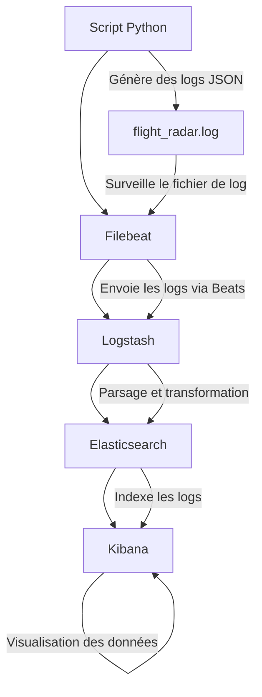

# ELK - Flight Radar

### Interaction globale du pipeline de données

Le pipeline de traitement des données dans ce projet suit un flux linéaire avec plusieurs étapes où chaque composant joue un rôle spécifique :

1. **Script Python -> Fichier de log** : Le script Python (`flight_radar.py`) interroge l'API FlightRadar24 pour obtenir des données de vol toutes les 5 minutes et les écrit dans un fichier de log. Ce fichier est ensuite surveillé par Filebeat.

2. **Filebeat -> Logstash** : Filebeat est un expéditeur de logs qui surveille le fichier de log généré par le script Python. Dès qu'une nouvelle ligne de log est ajoutée, Filebeat la lit, la traite légèrement (parsing JSON, etc.), puis envoie cette ligne à Logstash via le protocole Beats sur le port 5044.

3. **Logstash -> Elasticsearch** : Logstash reçoit les données de Filebeat, applique des filtres et des transformations pour structurer les logs (comme le parsing JSON, l'enrichissement des champs, etc.), puis envoie les données traitées à Elasticsearch pour stockage.

4. **Elasticsearch -> Kibana** : Elasticsearch indexe les données reçues de Logstash et les stocke de manière organisée. Kibana se connecte ensuite à Elasticsearch pour récupérer et visualiser les données indexées sous forme de tableaux de bord, de graphiques et d'analyses.

### 1. Interaction entre le script Python et Filebeat

- **Production de logs** : Le script Python génère des logs en temps réel. Chaque log contient des informations sur un vol spécifique (par exemple, ID de vol, altitude, latitude, longitude, etc.) sous forme de JSON. Ces logs sont écrits dans le fichier `flight_radar.log`.
  
- **Surveillance des logs** : Filebeat est configuré pour surveiller ce fichier de log spécifique (`/var/log/flight_radar/flight_radar*.log`). Lorsqu'une nouvelle ligne est ajoutée au fichier de log, Filebeat la détecte immédiatement.

- **Transmission à Logstash** : Filebeat lit la nouvelle ligne, la traite (notamment en la parsant si nécessaire), et l'envoie à Logstash via le protocole Beats sur le port 5044. La communication entre Filebeat et Logstash se fait via un canal réseau sécurisé et optimisé pour les performances.

### 2. Interaction entre Filebeat et Logstash

- **Réception des données** : Logstash est configuré pour écouter sur le port 5044, qui est utilisé par Filebeat pour envoyer les logs. Chaque log reçu est traité comme un événement.

- **Traitement des données** : Logstash applique un pipeline de filtres pour transformer les données. Voici les détails de ce traitement :
  - **Parsing JSON** : Le filtre `json` dans Logstash extrait les champs du JSON contenu dans le champ `message` envoyé par Filebeat.
  - **Enrichissement des champs** : Le filtre `mutate` est utilisé pour renommer le champ `timestamp` en `@timestamp`, un champ standard utilisé par Elasticsearch pour l'indexation temporelle des logs. Ce filtre supprime également le champ `message` pour éviter les doublons et alléger les données.

- **Transmission à Elasticsearch** : Une fois les données traitées, Logstash les envoie à Elasticsearch via une connexion HTTP sur le port 9200. Les logs sont envoyés dans des index dynamiques, nommés selon la date (par exemple, `flight-radar-logs-2024.08.18` pour un log généré le 18 août 2024). Cela permet une gestion fine des données historiques.

### 3. Interaction entre Logstash et Elasticsearch

- **Stockage et indexation** : Elasticsearch reçoit les données traitées de Logstash et les indexe. Chaque log est stocké dans un document Elasticsearch, avec des champs structurés permettant une recherche et une analyse efficace. L'utilisation du champ `@timestamp` permet à Elasticsearch de gérer les données chronologiques de manière optimale.

- **Gestion des index** : Elasticsearch crée un nouvel index chaque jour pour les logs, ce qui permet de segmenter les données par date. Cela facilite non seulement la gestion des volumes de données, mais aussi l'archivage ou la suppression des anciens logs.

### 4. Interaction entre Elasticsearch et Kibana

- **Visualisation des données** : Kibana se connecte à Elasticsearch pour récupérer les données indexées. Il permet aux utilisateurs de créer des visualisations interactives et des tableaux de bord basés sur les logs de vol.
  
- **Requêtes et analyses** : Les utilisateurs peuvent utiliser Kibana pour effectuer des requêtes avancées sur les données stockées dans Elasticsearch. Par exemple, ils peuvent visualiser les trajectoires de vol, analyser les tendances d'altitude ou de vitesse, ou encore créer des alertes basées sur certains critères.

### Résumé des interactions

- **Script Python et Filebeat** : Le script Python génère des logs que Filebeat surveille en temps réel. Filebeat lit les nouvelles entrées et les envoie à Logstash.
  
- **Filebeat et Logstash** : Filebeat transmet les logs à Logstash via le protocole Beats. Logstash reçoit ces logs, les transforme en appliquant des filtres et les prépare pour l'indexation dans Elasticsearch.
  
- **Logstash et Elasticsearch** : Logstash envoie les données transformées à Elasticsearch, où elles sont stockées et indexées. Elasticsearch gère les données temporelles et optimise les recherches.
  
- **Elasticsearch et Kibana** : Kibana permet la visualisation des données indexées dans Elasticsearch. Il offre une interface pour créer des tableaux de bord interactifs et analyser les données en temps réel.

Ce pipeline de traitement des données assure un flux continu depuis la collecte initiale des données jusqu'à leur visualisation, tout en garantissant une transformation et une gestion optimales des logs à chaque étape.

